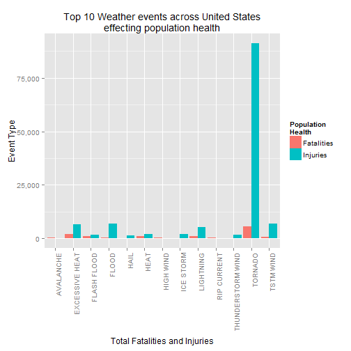
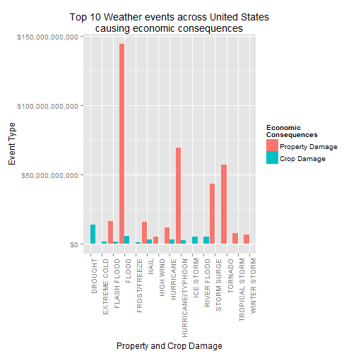
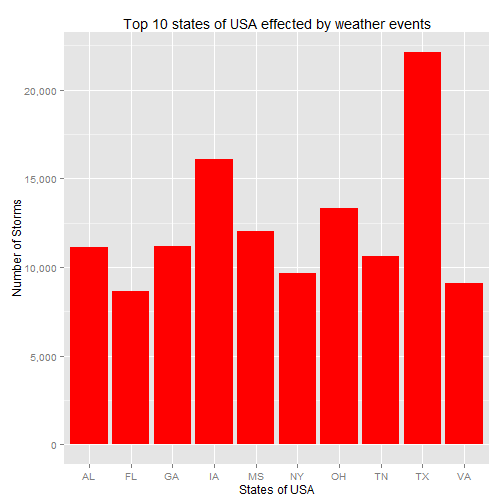

##Synopsis: 

The analysis presented in this repot is based on the data available with NOAA starting from year 1950 to November 2011. It is said that in the earlier years of the database there are generally fewer events recorded, most likely due to a lack of good records. More recent years should be considered more complete.

This report summerizes the top 10 catastrophic events across the United States in terms of both economic consequences and poplulation health events.  

The Flood, with 144B property loss and 5B of Crop loss, is top most storm factor which sabotaged the economic consequences, based on property and crop figures.  Furthermore, events like hurricane/typhoon, Tornado, Drought and Surges had also played thier roles in damanging the economics of United States. 

Tornados ranking top when it comes to devastating the population heath, with 5633 fatalities and 91346 injuries, followed by Flood, Excessive Heat and Lightning.

*It was noted that data prior to 1983 for health or economic damage is recorded only for Tornado events.*

              
Loading Required Libraries 
---


```r
        library(knitr)
        library(downloader)
        library(lubridate)
        library(plyr)
        library(ggplot2)
        library(scales)
        library(reshape2)
```


Data Processing
---
###Loading and Shaping Data###
The data is in the form of a comma-separated-value file compressed via the bzip2 algorithm to reduce its size. 
The download file is available at [Storm Data approx(47MB)](https://d396qusza40orc.cloudfront.net/repdata%2Fdata%2FStormData.csv.bz2)


```r
        if (!file.exists("rawData"))  {dir.create("rawData") }
#
        if (!file.exists("repdata-data-StormData.csv.bz2"))  
        { 
                 fileUrl <- "https://d396qusza40orc.cloudfront.net/repdata%2Fdata%2FStormData.csv.bz2" 
                 download(fileUrl,"repdata-data-StormData.csv.bz2" ,mode="wb")
        }

        stormdf <- read.csv(bzfile("repdata-data-StormData.csv.bz2"), header=TRUE, sep=",")

## Shaping Labels
        names(stormdf) <- toupper(names(stormdf))
        names(stormdf) <- gsub("__","CODE",names(stormdf)) 
        names(stormdf) <- gsub("LONGITUDE_","LONGITUDE_E",names(stormdf))
        names(stormdf) <- gsub("BGN_LOCATI","BGN_LOCATION",names(stormdf))

        stormSubsetdf <- subset(stormdf, FATALITIES > 0 | INJURIES > 0 | PROPDMG > 0 | CROPDMG > 0, select = c(1:8, 22:28,32:33))
        stormSubsetdf$BGN_DATE <- mdy_hms(stormSubsetdf$BGN_DATE)
```


Data Processing
---


####Processing of population health data####  
Reshaping and melting population health data for plotting. For that purpose we have used FATALITIES for number of fatalitities arises and INJURIES for number of injuries occurred. 


```r
        total_FI <- ddply(stormSubsetdf, .(EVTYPE), summarise, 
                        FATALITIES=sum(FATALITIES, na.rm = TRUE), 
                        INJURIES = sum(INJURIES, na.rm = TRUE))
#
        top10FI_total <- head(total_FI[order(-total_FI$FATALITIES,total_FI$INJURIES) , ] , 10)
        top10_fata <- head(total_FI[order(total_FI$FATALITIES, decreasing = TRUE), c("EVTYPE", "FATALITIES")] , 10)
        top10_inju <- head(total_FI[order(total_FI$INJURIES, decreasing = TRUE), c("EVTYPE", "INJURIES")] , 10)

        top10_FInew <- merge(top10_fata, top10_inju, by="EVTYPE", all=TRUE)
        melted_FI <- melt(top10_FInew, id.vars=c("EVTYPE"), measure.vars=c("FATALITIES","INJURIES"), preserve.na = FALSE)
```


####Processing of economic data####
Methodology:


The data fields used to dertermine economic values are _PROPDMG, PROPDMGEXP, CROPDMG and CROPDMGEXP_.
We assume that PROPDMGEXP and CROPDMGEXP corresponds to exponent. The economic values can be determined by multiplying PROPDMG by PROPDMGEXP and CROPDMG by CROPDMGEXP.

Resolving exponential values:  

The PROPDMGEXP has levels  , -, ?, +, 0, 1, 2, 3, 4, 5, 6, 7, 8, B, h, H, K, m, M   ,whereas CROPDMGEXP has   , ?, 0, 2, B, k, K, m, M 
we have to drive the cost by using  The methodology i used to 
According to [NATIONAL WEATHER SERVICE: Estimated Damage](http://www.nws.noaa.gov/wsom/manual/archives/NF429405.HTML#2.2.5  Estimated) _Alphabetical characters used to signify magnitude include K for thousands, M for millions, B for billions, and T for trillions_. In addtionl for the values like "1" "2" "3" "4" "5" "6" "7" "8" will be used as exponential value. Others such as ""  "-" "?" "+" "0" will be treated as 1 so that the actual value shall not be tempered.

Two new values are created for the purpose of calculating damage cost:  
1. PROPCOST: for calculating cost of property damage
2. CROPCOST: for calculating cost of crop damage


```r
stormSubsetdf$PROPCOST <-  stormSubsetdf$PROPDMG *      ifelse(toupper(stormSubsetdf$PROPDMGEXP) == "H", 100    , 
                                                        ifelse(toupper(stormSubsetdf$PROPDMGEXP) == "K", 1000   , 
                                                        ifelse(toupper(stormSubsetdf$PROPDMGEXP) == "M", 1e+06  , 
                                                        ifelse(toupper(stormSubsetdf$PROPDMGEXP) == "B", 1e+09  ,  
                                                        ifelse((stormSubsetdf$PROPDMGEXP == "?" | 
                                                                stormSubsetdf$PROPDMGEXP == "+" | 
                                                                stormSubsetdf$PROPDMGEXP == "+" | 
                                                                stormSubsetdf$PROPDMGEXP == "0"| 
                                                                stormSubsetdf$PROPDMGEXP == ""), 1              ,
                                                        10**!is.na(stormSubsetdf$PROPDMGEXP))))))  

stormSubsetdf$CROPCOST <-  stormSubsetdf$CROPDMG *      ifelse(toupper(stormSubsetdf$CROPDMGEXP) == "H", 100    , 
                                                        ifelse(toupper(stormSubsetdf$CROPDMGEXP) == "K", 1000   , 
                                                        ifelse(toupper(stormSubsetdf$CROPDMGEXP) == "M", 1e+06  , 
                                                        ifelse(toupper(stormSubsetdf$CROPDMGEXP) == "B", 1e+09  ,  
                                                        ifelse((stormSubsetdf$CROPDMGEXP == "?" | 
                                                                stormSubsetdf$CROPDMGEXP == "+" | 
                                                                stormSubsetdf$CROPDMGEXP == "+" | 
                                                                stormSubsetdf$CROPDMGEXP == "0"| 
                                                                stormSubsetdf$CROPDMGEXP == ""), 1              ,
                                                        10**!is.na(stormSubsetdf$CROPDMGEXP))))))  
```


Reshaping and melting economic consequences data for plotting. For that purpose we have used PROPCOST for property damage and CROPCOST for crop damage. 


```r
        total_PC <- ddply(stormSubsetdf, .(EVTYPE), summarise, 
                        PROPCOST  = sum(PROPCOST, na.rm = TRUE), 
                        CROPCOST  = sum(CROPCOST, na.rm = TRUE))
#
        top10PC_total <- head(total_PC[order(-total_PC$PROPCOST,-total_PC$CROPCOST) , ] , 10)
        top10_prop <- head(total_PC[order(total_PC$PROPCOST, decreasing = TRUE), c("EVTYPE", "PROPCOST")] , 10)
        top10_crop <- head(total_PC[order(total_PC$CROPCOST, decreasing = TRUE), c("EVTYPE", "CROPCOST")] , 10)

        top10_PCnew <- merge(top10_prop, top10_crop, by="EVTYPE", all=TRUE)
        melted_PC <- melt(top10_PCnew, id.vars=c("EVTYPE"), measure.vars=c("PROPCOST","CROPCOST"), preserve.na = FALSE)
```


####Processing top 10 Fatalities, Injuries, Property and Crop damage across states of USA####
 

```r
        totalstate_FI <- ddply(stormSubsetdf, .(EVTYPE,STATE), summarise, 
                        FATALITIES=sum(FATALITIES, na.rm = TRUE), 
                        INJURIES = sum(INJURIES, na.rm = TRUE))
#
        top10stateFI_total <- head(totalstate_FI[order(-totalstate_FI$FATALITIES,totalstate_FI$INJURIES) , ] , 10)

        totalstate_PC <- ddply(stormSubsetdf, .(EVTYPE,STATE), summarise, 
                                PROPERTY  = sum(PROPCOST, na.rm = TRUE), 
                                CROP  = sum(CROPCOST, na.rm = TRUE))
#
        top10statePC_total <- head(totalstate_PC[order(-totalstate_PC$PROPERTY,totalstate_PC$CROP) , ] , 10)
#
        states_Stormcount <- ddply(stormSubsetdf,.(STATE),summarise,count = length(EVTYPE))
        top10states <- head(states_Stormcount[order(states_Stormcount$count, decreasing=TRUE) , ] , 10)
```


Results
---


####Top 10 most harmful events across the United States with respect to polulation health####

The table below provides top 10 storm events effecting fatalities and injuries.


```r
#grid.table(top10FI_total, show.rownames=FALSE)
        top10FI_total[, c(1:3)]
```

```
##             EVTYPE FATALITIES INJURIES
## 407        TORNADO       5633    91346
## 61  EXCESSIVE HEAT       1903     6525
## 73     FLASH FLOOD        978     1777
## 151           HEAT        937     2100
## 258      LIGHTNING        816     5230
## 423      TSTM WIND        504     6957
## 86           FLOOD        470     6789
## 306    RIP CURRENT        368      232
## 200      HIGH WIND        248     1137
## 11       AVALANCHE        224      170
```

Figure showing top 10 Fatalities and Injuries

```r
        ggplot(melted_FI, aes(EVTYPE, value, fill=variable)) + geom_bar(stat="identity", position="dodge") + theme(axis.text.x = element_text(angle= 90, hjust = 1)) + labs(x="Total Fatalities and Injuries", y="Event Type", title="Top 10 Weather events across United States\neffecting population health") + scale_y_continuous(labels = comma) + scale_fill_discrete(name="Population\nHealth", labels=c("Fatalities", "Injuries"))
```

 


####Top 10 most harmful events across the United States with respect to economic consequences####

The table below provides top 10 storm events effecting property and crops.


```r
        top10PC_total[, c(1:3)]
```

```
##                EVTYPE  PROPCOST  CROPCOST
## 86              FLOOD 1.447e+11 5.662e+09
## 224 HURRICANE/TYPHOON 6.931e+10 2.608e+09
## 407           TORNADO 5.694e+10 4.150e+08
## 350       STORM SURGE 4.332e+10 5.000e+03
## 73        FLASH FLOOD 1.614e+10 1.421e+09
## 134              HAIL 1.573e+10 3.026e+09
## 215         HURRICANE 1.187e+10 2.742e+09
## 417    TROPICAL STORM 7.704e+09 6.783e+08
## 481      WINTER STORM 6.688e+09 2.694e+07
## 200         HIGH WIND 5.270e+09 6.386e+08
```

Figure showing top 10 property and crops.

```r
        ggplot(melted_PC, aes(EVTYPE, value, fill=variable)) + geom_bar(stat="identity", position="dodge") + theme(axis.text.x = element_text(angle= 90, hjust = 1)) + labs(x="Property and Crop Damage", y="Event Type", title="Top 10 Weather events across United States\ncausing economic consequences") + scale_y_continuous(labels = dollar) + scale_fill_discrete(name="Economic\nConsequences", labels=c("Property Damage", "Crop Damage"))
```

 


```r
top10stateFI_total
```

```
##              EVTYPE STATE FATALITIES INJURIES
## 864            HEAT    IL        653      241
## 1947        TORNADO    AL        617     7929
## 1990        TORNADO    TX        538     8207
## 1971        TORNADO    MS        450     6244
## 1970        TORNADO    MO        388     4330
## 1948        TORNADO    AR        379     5116
## 1989        TORNADO    TN        368     4748
## 345  EXCESSIVE HEAT    PA        359      320
## 327  EXCESSIVE HEAT    IL        330      352
## 1982        TORNADO    OK        296     4829
```
As you know Illinois has a widely varying climate. Most of Illinois has a humid continental climate with hot, humid summers and cool to cold winters.The all-time high temperature was 117 F (47 C), recorded on July 14, 1954, at East St. Louis, while the all time low temperature was -36 F (-38 C), recorded on January 5, 1999, at Congerville. A temperature of -37 F (-39 C), was recorded on January 15, 2009, at Rochelle.


```r
top10statePC_total
```

```
##                 EVTYPE STATE  PROPERTY      CROP
## 552              FLOOD    CA 1.168e+11 6.264e+08
## 1652       STORM SURGE    LA 3.174e+10 0.000e+00
## 1250 HURRICANE/TYPHOON    FL 2.760e+10 9.552e+08
## 1253 HURRICANE/TYPHOON    LA 2.100e+10 5.480e+07
## 1254 HURRICANE/TYPHOON    MS 1.349e+10 1.515e+09
## 1656       STORM SURGE    MS 1.127e+10 0.000e+00
## 1947           TORNADO    AL 6.321e+09 5.680e+07
## 2046    TROPICAL STORM    TX 5.491e+09 4.140e+06
## 1566       RIVER FLOOD    IL 5.022e+09 5.012e+09
## 2399      WINTER STORM    AL 5.002e+09 3.580e+05
```
All types of floods can occur in California, though 90% are caused by riverine flooding. Such flooding generally occurs as a result of excessive rainfall, excessive snowmelt, excessive runoff, levee failure or a combination of these sources.
Big Floods such as:
January 1982: Northern California flood
1986 California and Western Nevada floods


####Top 10 states of USA effected by weather events####
The plot showing top 10 states hit by weather stroms regardless of significance or size of catastrophe. 

```r
        ggplot(top10states, aes(STATE,count)) + geom_bar(stat="identity",fill="red") + labs(x="States of USA", y="Number of Storms", title="Top 10 states of USA effected by weather events") + scale_y_continuous(labels = comma) 
```

 
